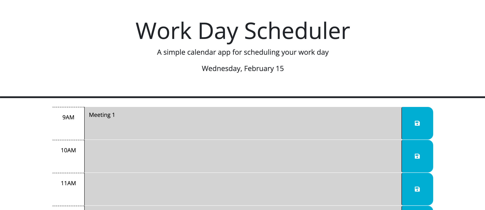

# scheduler-challenge

## Description

This Scheduler Challenge was created as part of the requirements for a Full Stack Development boot camp. Additionally, it is intended to help schedule events during the day, with visual feedback as to the current time when the application is opened.

## Usage

Navigate to the deployed application with the following link:
https://keimdm.github.io/scheduler-challenge/

### Header
The header contains a title and brief description of the application, along with the date and day of the week, which are updated when the page is loaded.

### Schedule View
The schedule view contains a series of time blocks, each one representing one hour between 9 AM and 6 PM. These time blocks are colored according to their relationship to the current time - blocks that happened in the past are gray, the current block is red, and future blocks are green. By clicking on the center portion of the block, users can enter in meeting details or other information and then press the save button to save it. These entries will persist when the page is loaded next time. 